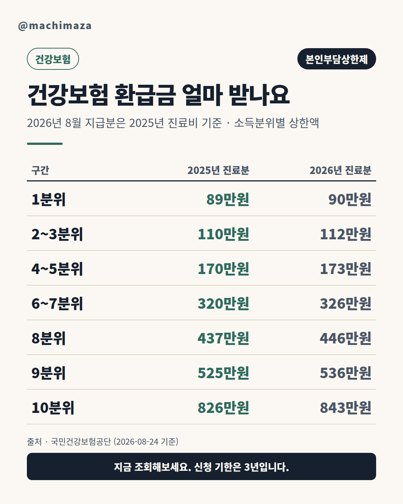
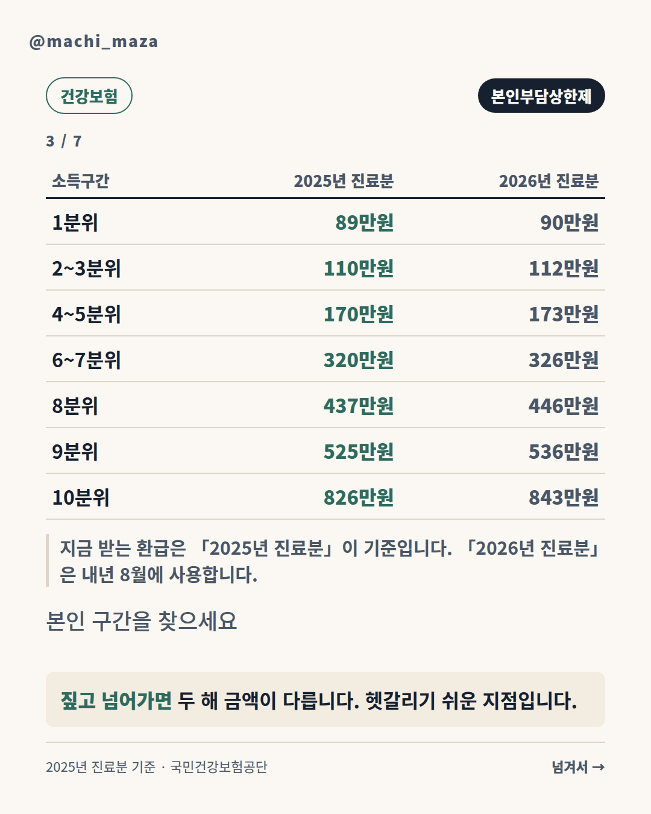
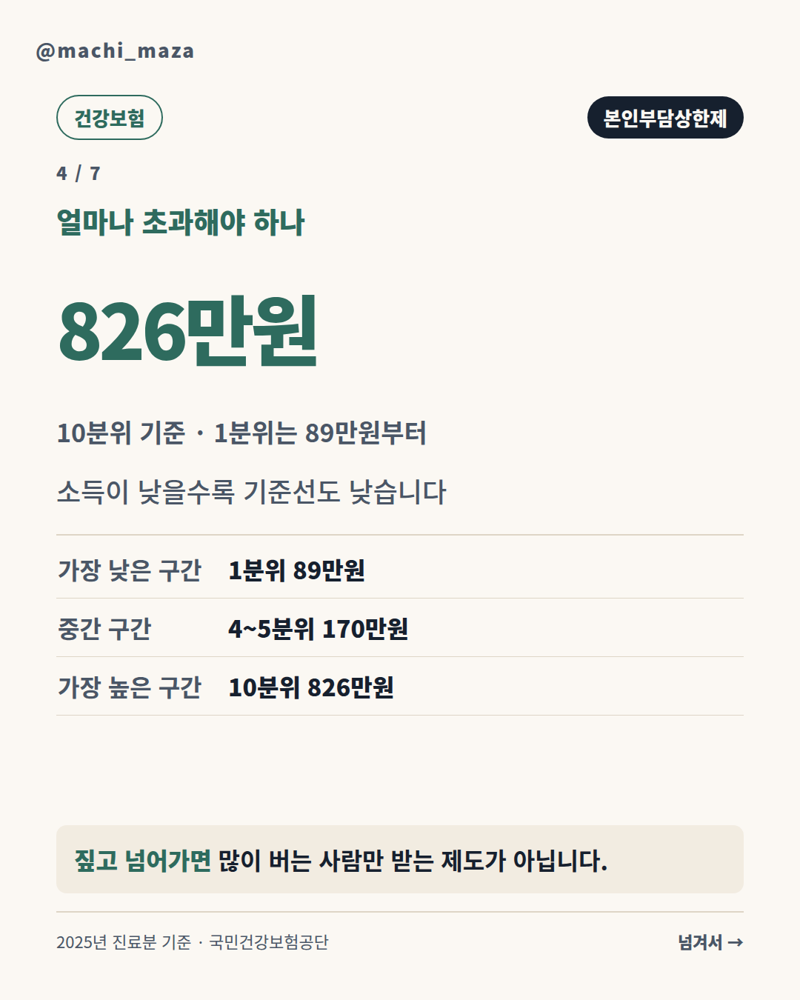
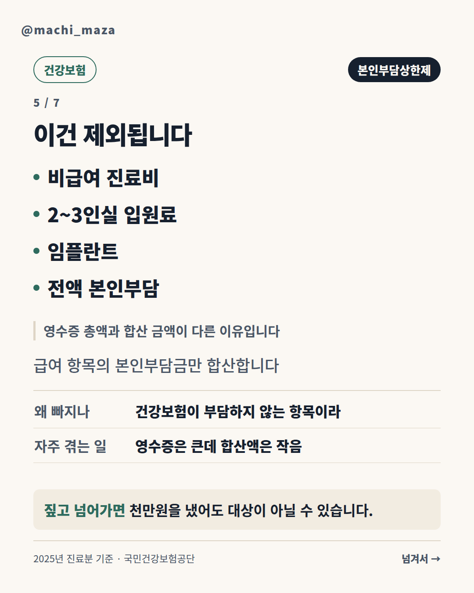
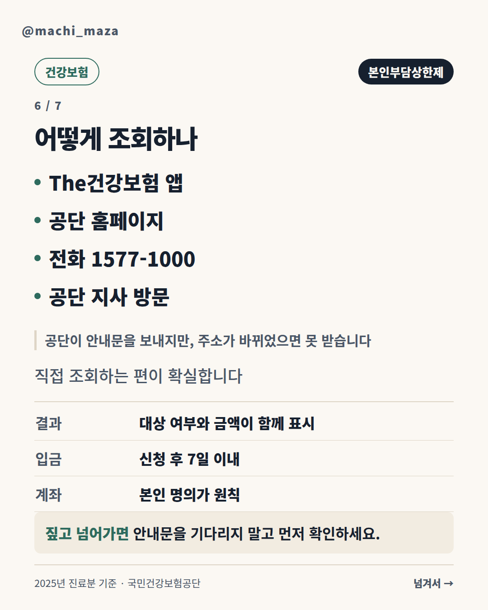

# 건강보험 환급금 얼마 받나요｜2026년 8월 지급분은 2025년 진료비 기준

**2025년 한 해 동안 낸 병원비 본인부담금이 89만원~826만원을 넘었다면, 넘은 금액을 돌려받습니다.** 기준선은 소득에 따라 다릅니다. 소득이 낮을수록 기준선도 낮아서, 가장 낮은 구간(1분위)이라면 **89만원**만 넘어도 대상입니다.

여기서 가장 많이 헷갈리는 지점을 먼저 짚습니다. **2026년 8월에 나오는 환급은 2026년 병원비가 아니라 2025년 병원비를 합산해 돌려주는 것입니다.** 그래서 2025년 기준 금액을 봐야 합니다. 검색하면 2026년 표가 먼저 나오는데, 그건 내년 8월에 쓸 표입니다.

**이 글이 답하는 것**

| 질문 | 어디에 |
|---|---|
| 얼마를 초과해야 받나 | 바로 아래 표 |
| 지금 받는 건 몇 년도 기준인가 | 「왜 8월인가」 |
| 병원비 다 합치면 되나 | 「무엇이 합산되고 무엇이 빠지나」 |
| 어떻게 조회하나 | 「어떻게 조회하고 신청하나」 |

---

## 얼마를 초과해야 받나

기준선은 소득분위에 따라 일곱 구간으로 나뉩니다. 두 해를 나란히 놓았습니다.

| 소득구간 | **2025년 진료분** (2026년 8월 지급) | 2026년 진료분 (2027년 8월 지급) |
|---|---|---|
| 1분위 | **89만원** | 90만원 |
| 2~3분위 | **110만원** | 112만원 |
| 4~5분위 | **170만원** | 173만원 |
| 6~7분위 | **320만원** | 326만원 |
| 8분위 | **437만원** | 446만원 |
| 9분위 | **525만원** | 536만원 |
| 10분위 | **826만원** | 843만원 |

*소득분위는 세대(주민등록상 함께 묶인 가구)별 연평균 보험료를 기준으로 구분합니다. 1분위가 가장 낮습니다.*

**지금 확인해야 할 것은 왼쪽 열입니다.** 오른쪽 열은 지금 병원에 다니는 분들이 내년 8월에 쓸 숫자입니다.

두 열의 차이가 크지 않아 보이지만, 10분위는 **17만원** 차이입니다. 어느 표를 보느냐에 따라 "대상이다 / 아니다"가 갈릴 수 있습니다.

---

## 왜 8월인가

이 제도는 **1년치를 모아서 계산**합니다. 공단이 안내하는 방식은 두 가지입니다.

| 방식 | 언제 | 어떻게 |
|---|---|---|
| **사전급여** | 진료 중에 바로 | 같은 병원에서 그 해 본인부담금이 상한액을 초과하면, 환자는 상한액까지만 내고 초과하는 금액은 병원이 공단에 청구합니다 |
| **사후환급** | 다음해 8월말경 | 여러 병원에서 낸 1년치 본인부담금을 합산해, 초과하는 금액을 공단이 환자에게 돌려줍니다 |

대부분은 **사후환급**에 해당합니다. 한 병원에서만 큰 금액을 사용하는 경우는 드물기 때문입니다.

> 공단 안내: 사후급여는 *"당해 연도에 환자가 여러 병·의원에서 진료를 받고 부담한 연간 본인부담금을 **다음해 8월말경에 최종 합산**"* 하는 방식입니다.

그래서 **8월이 이 제도의 시즌**입니다. 8월에 검색이 몰리는 이유이고, 동시에 연도를 헷갈리기 가장 쉬운 시점이기도 합니다.

---

## 무엇이 합산되고 무엇이 빠지나

여기서 실제 금액이 크게 갈립니다. **병원에 낸 돈 전부가 합산되는 것이 아닙니다.**

| 합산됩니다 | 제외됩니다 |
|---|---|
| 입원 본인부담금 | 비급여 진료비 |
| 외래 본인부담금 | 선별급여 |
| 약국 본인부담금 | 전액 본인부담 진료비 |
| | 2~3인실 입원료 |
| | 임플란트 본인부담금 |
| | 추나요법 본인부담금 |
| | 보험료를 안 낸 기간의 진료 |

공단이 밝힌 제외 항목은 다음과 같습니다.

> *"비급여, 선별급여, 전액본인부담, 임플란트, 상급병실(2-3인실) 입원료, 추나요법 본인일부부담금 등은 제외"*

**영수증 총액과 합산 금액이 다른 이유가 이것입니다.** 병원비를 1,000만원 냈어도 그중 상당액이 비급여라면 합산 금액은 훨씬 작아집니다.

반대로 **여러 병원과 약국에 흩어져 있어도 전부 합산됩니다.** 동네 의원, 대학병원, 약국을 다 합칩니다. 그래서 큰 수술 한 번이 없어도 만성질환으로 자주 다녔다면 대상이 될 수 있습니다.

---

## 내 소득구간은 어떻게 아나

가장 막히는 부분입니다. **소득분위는 본인이 계산할 수 없습니다.**

가구별 연평균 보험료를 기준으로 공단이 나누기 때문입니다. 직장가입자와 지역가입자를 각각 줄 세운 뒤 열 구간으로 나누는 구조라, 내 보험료만 알아서는 몇 분위인지 알 수 없습니다.

**방법은 하나입니다 — 조회하면 결과가 나옵니다.**

조회하면 "대상 / 비대상"과 금액이 바로 표시되므로, 분위를 먼저 알아낼 필요가 없습니다. 표는 "왜 그 금액인지" 이해하는 용도로만 보시면 됩니다.

---

## 요양병원에 오래 계셨다면 금액이 다릅니다

**요양병원 입원일수가 120일을 초과하면 상한액이 따로 적용됩니다.** 금액이 올라갑니다.

| 소득구간 | **2025년** 요양병원 120일 초과 | 2026년 |
|---|---|---|
| 1분위 | **141만원** | 143만원 |
| 2~3분위 | **178만원** | 181만원 |
| 4~5분위 | **240만원** | 245만원 |
| 6~7분위 | **396만원** | 404만원 |
| 8분위 | **569만원** | 580만원 |
| 9분위 | **684만원** | 698만원 |
| 10분위 | **1,074만원** | 1,096만원 |

2025년 기준 1분위를 보면 89만원에서 **141만원**으로 올라갑니다. 기준선이 높아진다는 것은 **그만큼 덜 돌려받는다**는 뜻입니다.

그리고 **요양병원은 사전급여 대상에서 제외**됩니다. 진료 중에 바로 돌려받지 못하고, 다음해 8월 사후환급으로만 처리됩니다.

---

## 조회했는데 0원이라고 나오는 경우

대상이 아니라는 결과가 나오면 보통 셋 중 하나입니다.

**1. 합산 금액이 생각보다 작습니다**

앞에서 본 제외 항목 때문입니다. 큰 수술을 받았어도 비급여 비중이 높으면 합산 금액은 크게 줄어듭니다. **영수증에 찍힌 총액이 아니라, 급여 항목의 본인부담금만** 세기 때문입니다.

**2. 이미 병원에서 처리됐습니다**

같은 병원에서 그 해 본인부담금이 상한액을 초과하면, 병원이 그 자리에서 상한액까지만 받고 나머지는 공단에 청구합니다(사전급여). 이 경우 돌려받을 것이 남아 있지 않습니다.

**3. 아직 계산이 끝나지 않았습니다**

사후환급은 1년치를 모아 다음해 8월말경에 계산합니다. 그 전에 조회하면 결과가 나오지 않습니다.

---

## 상한액은 매년 오릅니다 — 옛 숫자를 조심하세요

상한액은 전국소비자물가변동률을 반영해 해마다 조정됩니다. 최고 구간을 보면 이렇습니다.

| 연도 | 10분위 상한액 |
|---|---|
| 2020년 | 582만원 |
| 2025년 | **826만원** |
| 2026년 | 843만원 |

5년 사이 **244만원**이 올랐습니다. 그래서 오래된 안내를 그대로 믿으면, 실제로는 대상인데 대상이 아니라고 판단하거나 그 반대가 될 수 있습니다.

실제로 **국민건강보험공단 홈페이지의 제도 안내 페이지는 2026년 현재까지 2020년 금액을 예시로 표시하고 있습니다.** 제도 구조(사전급여·사후환급, 요양병원 120일 기준)를 설명하는 문서라 예시 금액이 갱신되지 않은 것으로 보입니다. 제도를 이해하는 데는 문제가 없지만, **금액은 매년 1월 나오는 상한액 변경 안내를 봐야 합니다.**

이 글의 금액은 그 안내에서 확인했습니다. 위 출처 섹션에 공문 번호와 날짜를 적어두었습니다.

---

## 사전급여 — 병원에서 바로 적용되는 경우

같은 병원에서 그 해 낸 본인부담금이 최고상한액을 초과하면, 그 시점부터는 환자가 더 내지 않습니다. **2026년 기준 사전급여 최고상한액은 843만원**입니다.

| | 사전급여 | 사후환급 |
|---|---|---|
| 적용 시점 | 진료 중 바로 | 다음해 8월말경 |
| 대상 | **같은 병원** 한 곳에서 초과 | 여러 병원·약국 합산 |
| 요양병원 | **제외** | 포함 |
| 신청 | 병원이 공단에 청구 | 본인이 조회·신청 |

**요양병원은 사전급여 대상에서 제외됩니다.** 장기 입원 중이더라도 병원에서 바로 정리되지 않고, 다음해 8월 사후환급으로만 받습니다.

큰 병으로 한 병원에 오래 다니고 있다면, 사전급여가 적용되고 있는지 원무과에 확인해두는 편이 좋습니다. 적용되고 있다면 그 부분은 나중에 또 받을 것이 없습니다.

---

## 어떻게 조회하고 신청하나

공단이 대상자에게 안내문을 보냅니다. 다만 **주소가 바뀌었거나 우편을 놓쳤다면 안내문이 닿지 않습니다.** 직접 조회하는 편이 확실합니다.

| 방법 | 비고 |
|---|---|
| The건강보험 앱 | 공동인증서 또는 간편인증 |
| 공단 홈페이지 | 사이버민원으로 온라인 접수 가능 |
| 전화 1577-1000 | 본인 확인 후 안내 |
| 가까운 공단 지사 | 신분증 지참 |

신청하면 **접수일로부터 7일 이내**에 지정한 계좌로 입금됩니다.

**본인 계좌가 원칙입니다.** 다른 사람 계좌로 받으려면 별도 위임 절차가 필요하므로, 가족 대신 신청하는 경우 미리 확인하시는 편이 좋습니다.

---

## 놓치기 쉬운 세 가지

**1. 신청 기한은 3년입니다**

환급금은 **지급신청서를 받은 날로부터 3년**이 지나면 소멸합니다. 재작년 것을 아직 안 받았다면 지금 함께 확인하세요. 조회하면 미신청 건이 같이 나옵니다.

**2. 가족은 각자 계산합니다**

지역가입자 보험료는 주민등록상 함께 묶인 가구(세대) 단위로 합산되지만, **본인부담상한제는 개인별로 계산합니다.** 부모님과 본인의 병원비를 합칠 수 없고, 반대로 부모님이 따로 대상자일 수 있습니다. **가족 각자 조회해야 합니다.**

**3. 실손보험을 받았어도 대상입니다**

실손의료보험금을 받았다는 이유로 환급 대상에서 빠지지는 않습니다. 다만 실손보험 약관에 따라 **이미 받은 보험금 중 일부를 보험사에 돌려줘야 할 수 있으므로**, 가입한 보험사에 확인하시기 바랍니다.

---

## 특히 자주 놓치는 경우

대상인데 받아가지 않는 분들이 있습니다. 공통점이 있습니다.

**큰 수술 없이 자주 다닌 경우**

한 번에 큰 금액을 지출한 적이 없어서 "나는 아니겠지" 하고 넘어갑니다. 하지만 이 제도는 **1년치를 전부 합산합니다.** 만성질환으로 매달 병원과 약국에 다녔다면 합산 금액이 생각보다 큽니다.

**가족 중 한 명만 확인한 경우**

앞서 적었듯 **개인별로 계산합니다.** 본인이 대상이 아니어도 부모님은 대상일 수 있습니다. 특히 고령이거나 요양병원에 계신 가족이 있다면 각자 조회해야 합니다.

**이사했거나 연락처가 바뀐 경우**

공단이 안내문을 보내지만 주소가 바뀌었으면 닿지 않습니다. **안내문이 없다고 대상이 아닌 것은 아닙니다.**

**작년 것을 이미 놓친 경우**

신청 기한이 3년이라 아직 유효할 수 있습니다. 조회하면 미신청 건이 함께 나옵니다.

한 가지 덧붙이면, **의료급여 수급자는 이 제도가 아니라 별도 제도가 적용됩니다.** 해당하신다면 주민센터나 공단에 어느 쪽인지 먼저 확인하시는 편이 좋습니다.

---

## 자주 묻는 질문

**Q1. 안내문을 못 받았는데 대상이 아닌 건가요?**

아닙니다. 주소 변경이나 우편 분실로 안내문이 닿지 않는 경우가 있습니다. 직접 조회해보시는 편이 확실합니다.

**Q2. 2026년에 낸 병원비는 언제 돌려받나요?**

2027년 8월말경입니다. 그때는 2026년 상한액(1분위 90만원 ~ 10분위 843만원)이 적용됩니다.

**Q3. 병원비를 1,000만원 냈는데 왜 대상이 아니라고 나오나요?**

영수증 총액이 아니라 **급여 항목의 본인부담금만** 합산하기 때문입니다. 비급여, 선별급여, 전액 본인부담, 2~3인실 입원료, 임플란트 등은 제외됩니다.

**Q4. 소득분위를 미리 알 수 있나요?**

세대별 연평균 보험료로 공단이 산정하므로 본인이 계산하기 어렵습니다. 조회하면 결과에 함께 표시됩니다.

**Q5. 이미 병원에서 깎아줬는데 또 받나요?**

같은 병원에서 사전급여로 이미 깎아줬다면 그 부분은 처리가 끝난 것입니다. 다만 **다른 병원과 약국에서 낸 금액이 남아 있다면** 사후환급 대상이 될 수 있습니다.

**Q6. 요양병원 120일은 어떻게 세나요?**

해당 연도의 요양병원 입원일수를 합산합니다. 120일을 초과하면 상한액이 올라간 표가 적용됩니다.

**Q7. 돌아가신 분의 환급금도 받을 수 있나요?**

상속인이 신청할 수 있습니다. 필요한 서류가 있으므로 공단(1577-1000)에 먼저 확인하시기 바랍니다.

**Q8. 건강보험료를 안 낸 기간이 있으면 어떻게 되나요?**

보험료 체납 후 받은 진료는 합산에서 제외됩니다.

**Q9. 소득분위는 매년 바뀌나요?**

세대의 연평균 보험료를 기준으로 매년 산정하므로 바뀔 수 있습니다. 소득이나 재산이 줄어 보험료가 내려갔다면 분위가 낮아지고, 기준선도 함께 낮아집니다. 작년에 대상이 아니었더라도 올해는 다를 수 있습니다.

**Q10. 조회는 언제부터 할 수 있나요?**

사후환급은 1년치를 모아 다음해 8월말경에 계산합니다. 2025년 진료분이라면 2026년 8월부터 결과가 나옵니다. 그 전에 조회하면 "계산 중"이거나 결과가 표시되지 않습니다.

**Q11. 환급금은 어디로 입금되나요?**

신청할 때 지정한 계좌로 접수일부터 7일 이내에 입금됩니다. 본인 계좌가 원칙이며, 가족 계좌로 받으려면 별도 절차가 필요합니다.

**Q12. 병원비를 카드로 냈는데도 되나요?**

결제 수단과 무관합니다. 급여 항목의 본인부담금인지만 판단합니다.

---

## 지금 할 일

- [ ] **The건강보험 앱이나 1577-1000으로 조회** — 안내문을 기다리지 마세요
- [ ] 결과에 **재작년 미신청 건**이 있는지 함께 확인 (기한 3년)
- [ ] **가족도 각자 조회** — 개인별로 계산합니다
- [ ] 요양병원에 120일 넘게 계셨다면 **다른 표**를 보세요

8월에 나오는 환급은 작년에 낸 병원비를 합산한 결과입니다. 2025년 진료분이라면 1분위 89만원 ~ 10분위 826만원이 기준선입니다.

---

## 공식 출처 및 확인 링크

이 글의 모든 수치는 아래 원문에서 직접 확인했습니다.

- [2025년도 본인부담상한액 변경 안내 — 국민건강보험공단 공문 (보험 제2025-12, 2025-01-07)](https://www.kha.or.kr/kha_home/notice_list.do?mode=view&articleNo=43830)
- [2026년도 본인부담상한액 변경 안내 — 국민건강보험공단 공문 (재난상한제운영부-82, 2026-01-06)](https://www.kha.or.kr/kha_home/notice_list.do?mode=view&articleNo=46119)
- [본인부담액상한제 (국민건강보험법 시행령 제19조) — 국민건강보험공단](https://www.nhis.or.kr/static/html/wbma/c/wbmac0209.html)
- [본인부담금환급금 (국민건강보험법 제47조) — 국민건강보험공단](https://www.nhis.or.kr/static/html/wbma/c/wbmac0211.html)

**금액에 관한 참고.** 공단 홈페이지의 제도 안내 페이지는 제도 구조를 설명하는 문서라 예시 금액이 갱신되지 않은 상태입니다. 이 글의 금액은 공단이 매년 1월 발송하는 **상한액 변경 안내 공문**에서 확인했습니다.

문의: 국민건강보험공단 **1577-1000**

**2025년 진료분 기준 · 최종 확인 2026-08-24**

---

*이 글은 일반적인 정보 제공을 위한 것이며, 개인의 상태에 따라 다를 수 있습니다. 정확한 보험료와 자격은 국민건강보험공단(1577-1000)에 확인하시기 바랍니다.*

*— 마치마자 · 정부·공공기관 원문을 직접 확인해 정리하며, 제도 개정 시 갱신합니다.*
