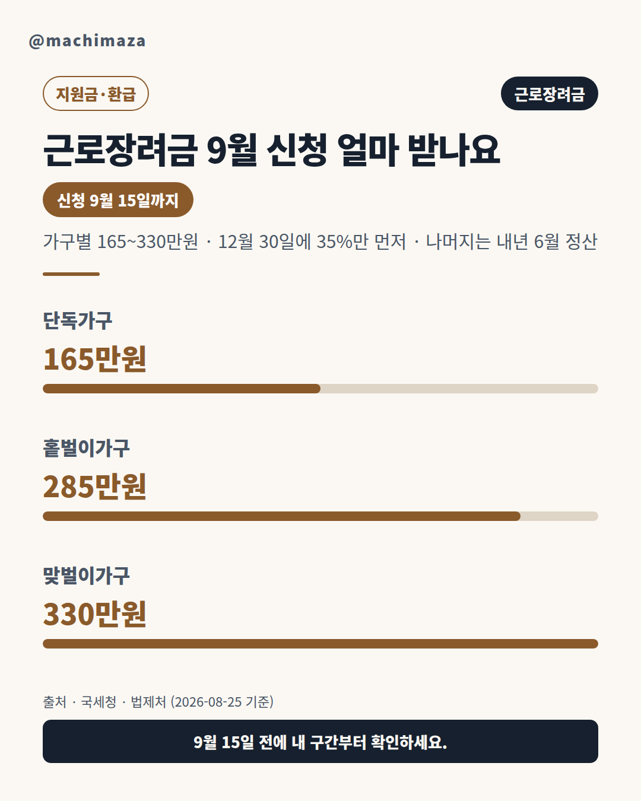
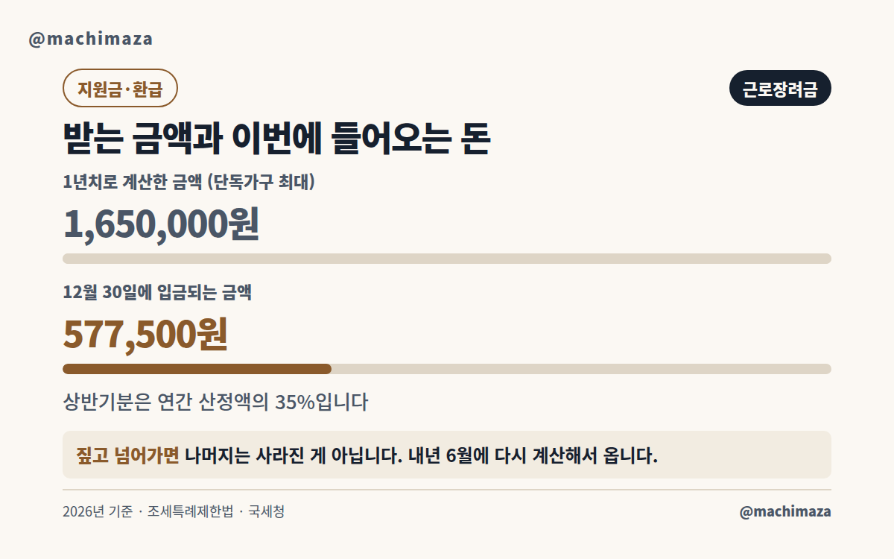
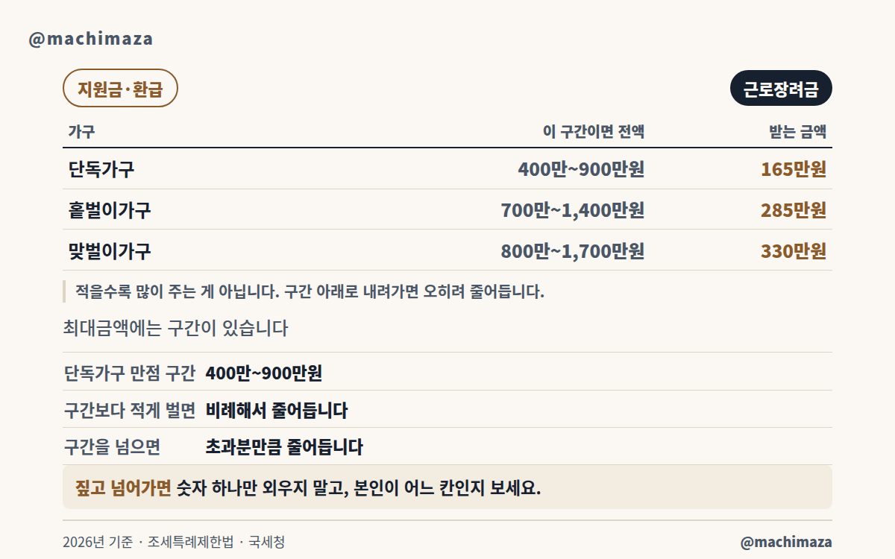
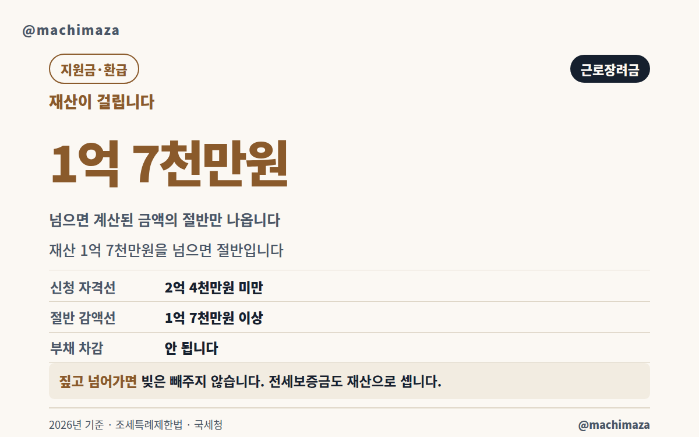
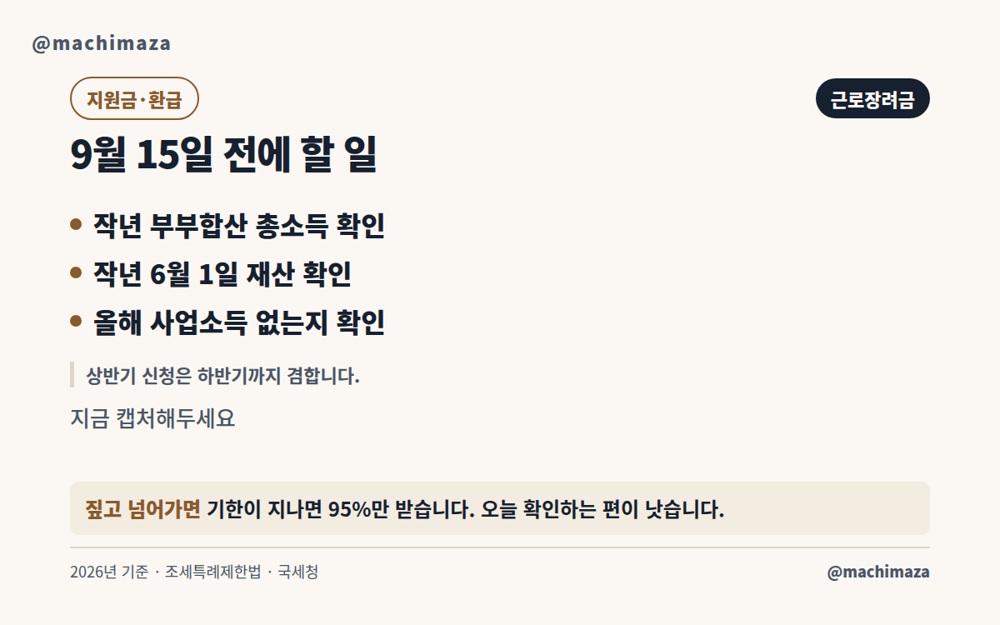

# 근로장려금 9월 신청 얼마 받나요

**577,500원**. 단독가구가 받을 수 있는 최대금액을 꽉 채워도, 올해 12월 30일에 통장에 들어오는 돈은 이 정도입니다. 최대금액이 165만원인데 왜 이 금액일까요. 9월에 하는 신청이 정기신청과 다른 물건이기 때문입니다.

9월 1일부터 15일까지 받는 것은 **반기신청**입니다. 1년치를 한 번에 주는 제도가 아닙니다. 상반기에 번 돈으로 1년치를 미리 계산합니다. 그중 일부를 먼저 주고, 나머지는 내년에 맞춰봅니다. 이 구조를 모르면 12월 입금액을 보고 당황하게 됩니다.

이 글은 국세청 안내와 조세특례제한법 원문을 직접 열어 확인한 내용만 담았습니다. 확인일은 2026년 8월 25일이고, 원문 주소는 맨 아래에 있습니다.

## 9월 신청은 정기신청과 무엇이 다른가

근로장려금을 신청하는 길은 두 갈래입니다.

| 구분 | 대상 | 무슨 소득으로 계산하나 | 신청 시기 |
|---|---|---|---|
| 정기신청 | 근로·사업·종교인 소득자 | 지난해 1년치 소득 | 5월 1일 ~ 6월 1일 |
| 반기신청 (상반기분) | 근로소득자만 | 올해 상반기 소득 | **9월 1일 ~ 9월 15일** |
| 반기신청 (하반기분) | 근로소득자만 | 올해 1년치 소득 | 내년 3월 1일 ~ 3월 15일 |

정기신청은 이미 끝난 해를 봅니다. 그래서 금액이 확정됩니다. 반기신청은 아직 끝나지 않은 해를 다룹니다. **먼저 주고 나중에 맞춰보는** 수밖에 없습니다. 9월 신청분에 35%가 붙는 이유입니다.

차이가 하나 더 있습니다. 반기신청은 **올해 근로소득만 있는 사람**만 할 수 있습니다. 사업소득이 조금이라도 섞이면 어떻게 될까요. 신청은 접수됩니다. 다만 5월에 정기신청한 것으로 처리됩니다. 돈은 2027년 9월에야 나옵니다. 배달이나 프리랜서 일을 병행하셨다면 여기부터 보셔야 합니다.

## 내 가구는 어디인가

금액을 보기 전에 본인이 어느 가구인지부터 정해야 합니다. 세 가지뿐이고, 기준은 배우자의 소득과 부양가족의 유무입니다.

- **단독가구** — 배우자도, 18세 미만 부양자녀도, 70세 이상 직계존속도 없는 가구입니다.
- **홑벌이가구** — 배우자의 총급여액 등이 300만원 미만인 경우입니다. 배우자가 아예 없어도 18세 미만 자녀나 70세 이상 부모를 부양하면 여기 들어갑니다. 이때 부양가족은 연간 소득금액이 100만원 이하이고 주민등록상 함께 살아야 합니다.
- **맞벌이가구** — 본인과 배우자 **각각의** 총급여액 등이 300만원 이상인 경우입니다. 합쳐서 300만원이 아니라 각각입니다.

배우자가 있는데도 그쪽 소득이 300만원에 못 미치면 맞벌이가 아니라 홑벌이입니다. 홑벌이와 맞벌이는 기준금액도 최대금액도 다르기 때문에, 여기서 잘못 짚으면 이후 계산이 전부 어긋납니다.

## 최대금액에는 구간이 있습니다

여기가 이 글에서 가장 중요한 부분입니다. 검색해서 나오는 글은 대부분 "최대 165만원", "최대 330만원"까지만 적고 끝냅니다. 그런데 조세특례제한법 제100조의5를 열어보면, **그 최대금액이 나오는 구간이 따로 정해져 있습니다**.

| 가구 | 이 구간이면 전액 | 그때 받는 금액 | 여기서 0원이 됩니다 |
|---|---|---|---|
| 단독가구 | 총급여액 등 400만 ~ 900만원 | 165만원 | 2,200만원 |
| 홑벌이가구 | 총급여액 등 700만 ~ 1,400만원 | 285만원 | 3,200만원 |
| 맞벌이가구 | 총급여액 등 800만 ~ 1,700만원 | 330만원 | 4,400만원 |

구간보다 **적게 벌면 오히려 줄어듭니다**. 단독가구를 봅시다. 총급여액 등이 400만원 미만이면 `총급여액 등 × 165/400` 으로 계산합니다. 300만원을 벌었다면 165만원이 아닙니다. 그 4분의 3 수준입니다. 이 제도의 이름이 근로장려금입니다. 일한 만큼 늘어나는 구간을 앞에 둔 이유입니다.

구간을 넘어도 줄어듭니다. 단독가구는 900만원부터 깎입니다. 그러다 2,200만원에서 0이 됩니다. 홑벌이는 1,400만원부터 깎여 3,200만원에서 사라집니다. 맞벌이는 1,700만원부터 깎여 4,400만원에서 사라집니다.

"얼마 받나요"의 정직한 답은 금액 하나가 아닙니다. **본인 총급여액 등이 어느 칸에 있느냐**입니다. 표에서 본인 줄부터 찾으세요.

## 12월에 들어오는 돈은 35%입니다

가구도 정했고 구간도 확인했다면, 이제 실제로 언제 얼마가 들어오는지가 남습니다.

상반기분 지급기한은 **2026년 12월 30일**입니다. 지급액은 **1년치로 계산한 금액의 35%** 입니다. 조세특례제한법 제100조의5 제2항이 정한 비율입니다.

| 가구 | 1년치로 계산한 최대금액 | 12월 30일 입금 (35%) |
|---|---|---|
| 단독가구 | 165만원 | 577,500원 |
| 홑벌이가구 | 285만원 | 997,500원 |
| 맞벌이가구 | 330만원 | 1,155,000원 |

나머지는 없어진 것이 아닙니다. **2027년 6월 30일**까지 하반기분을 지급하면서 그때 정산(더 낼 수도, 돌려받을 수도 있음)합니다. 이 정산이 반기신청에서 가장 오해가 많은 대목입니다.

상반기분은 **작년(2025년) 요건**으로 판단해 먼저 줍니다. 그리고 2027년 6월에 **올해(2026년) 요건**으로 다시 계산합니다. 올해 소득이 늘었다면 어떻게 될까요. 재산이 불었다면요. 그때 **환수**될 수 있습니다. 12월에 들어온 돈을 확정된 내 돈으로 여기지 않는 편이 안전합니다.

1년치를 계산하는 방식도 정해져 있습니다. 상반기 근로소득을 근무한 달수로 나눕니다. 거기에 근무월수와 6을 더한 값을 곱합니다. 넉 달만 일했다면 어떻게 될까요. 그 넉 달치 평균으로 열 달치를 추정합니다.

## 재산이 1억 7천만원을 넘으면 절반

소득 요건을 통과해도 재산에서 걸리는 경우가 많습니다. 기준선이 두 개라는 점을 놓치기 쉽습니다.

- **2억 4천만원 미만** — 이 선을 넘으면 아예 신청 자격이 없습니다.
- **1억 7천만원 이상** — 자격은 있지만 계산된 금액의 **50%만** 나옵니다.

재산이 1억 8천만원인 단독가구를 봅시다. 165만원이 아니라 825,000원을 받습니다. 이 감액은 조세특례제한법 제100조의5 제4항에 있습니다. 자격 기준선은 같은 법 제100조의3에 있습니다.

재산에는 무엇이 들어갈까요. 주택·토지·건축물의 시가표준액이 들어갑니다. 승용자동차도 들어갑니다. 영업용은 뺍니다. 전세보증금, 예금, 유가증권, 회원권, 분양권도 재산입니다. 세 가지만 기억하시면 됩니다.

첫째, **빚은 빼주지 않습니다**. 대출을 끼고 산 집도 시가표준액 전체가 잡힙니다.

둘째, **전세보증금도 재산입니다**. 주택은 두 값 중 작은 쪽으로 봅니다. 기준시가의 55%로 계산한 간주전세금과 실제 보증금입니다.

셋째, 판단 시점은 **작년 6월 1일**입니다. 올해 재산이 줄었어도 상반기분 심사에는 반영되지 않습니다.

## 신청하는 네 가지 경로

신청 자체는 어렵지 않습니다. 서비스 이용시간은 06시부터 24시까지입니다.

1. **홈택스(모바일·PC)** — 로그인합니다. 장려금·연말정산·전자기부금 메뉴로 갑니다. 근로·자녀장려금을 고르고 신청하기를 누릅니다.
2. **ARS 1544-9944** — 반기신청은 안내 번호를 누르지 않습니다. 주민등록번호 13자리를 바로 넣습니다. 다음은 개별인증번호 8자리입니다. 등록된 본인 번호로 걸면 인증번호는 생략됩니다.
3. **안내문 QR·국민비서·네이버 전자문서** — 안내문을 받으셨다면 여기서 바로 됩니다. 인증번호가 자동으로 채워집니다. 로그인도 필요 없습니다.
4. **장려금 상담센터 1566-3636** — 평일 9시부터 18시까지 받습니다. 상담사나 세무서 직원이 대신 신청해 줍니다. 본인 동의가 필요합니다.

**안내문을 못 받았어도 신청할 수 있습니다**. 안내문은 자격의 근거가 아닙니다. 국세청이 자료를 보고 대상 같다고 알려주는 것입니다. 홈택스에서 로그인한 뒤 직접입력신청으로 들어가면 됩니다.

반대도 마찬가지입니다. 안내문을 받았다고 지급이 확정되지는 않습니다. 요건은 심사에서 다시 봅니다.

신청기간에 자동신청에 미리 동의해두면 이후 2년간 안내 대상이 될 때 자동으로 신청됩니다. 다만 요건을 충족하지 않으면 자동신청도 되지 않습니다.

## 9월 15일을 놓치면

기한이 지나도 길이 아주 막히는 것은 아닙니다. 다만 손해가 생깁니다.

기한 후 신청은 2026년 6월 2일부터 12월 1일까지 열려 있습니다. 이때 신청하면 **금액의 95%만** 나옵니다. 5%는 늦은 대가입니다. 금액이 클수록 손해도 커집니다.

체납액이 있다면 환급금의 **30%를 한도로** 체납액에 충당됩니다. 전액이 압류되는 것은 아니지만, 통장에 들어오는 금액은 그만큼 줄어듭니다.

허위로 신청하면 돌려주는 것으로 끝나지 않습니다. 하루 10만분의 22의 가산세가 붙습니다. 고의나 중대한 과실이면 2년간 지급이 제한됩니다. 사기나 부정한 방법이면 5년입니다.

편한 점도 있습니다. **상반기분을 신청하면 하반기분도 신청한 것으로 봅니다**. 내년 3월에 다시 신청하지 않아도 됩니다. 조세특례제한법 제100조의6 제9항입니다.

다만 상반기 지급 때는 근로장려금만 나옵니다. 자녀장려금은 하반기 정산 때 함께 나옵니다.

## 신청 전에 정리하고 갈 것

여기까지가 금액과 기한입니다. 아래는 신청 화면을 열기 전에 한 번씩 짚고 갈 내용입니다.

### 정기신청과 반기신청 중 무엇이 유리한가

둘 다 자격이 된다면 고민이 생깁니다. 정답은 상황에 따라 다릅니다. 판단 기준을 세 가지로 정리했습니다.

**첫째, 돈이 필요한 시점입니다**. 반기신청은 12월에 일부가 먼저 들어옵니다. 정기신청은 이듬해 9월 말까지 기다려야 합니다. 급하다면 반기가 낫습니다.

**둘째, 올해 소득이 늘고 있는지입니다**. 상반기분은 작년 요건으로 먼저 줍니다. 올해 소득이 크게 늘면 내년 6월에 환수될 수 있습니다. 승진했거나 이직으로 급여가 오르셨다면 정기신청이 마음 편합니다.

**셋째, 소득 종류입니다**. 올해 사업소득이 조금이라도 생겼다면 선택지가 없습니다. 반기신청을 넣어도 정기신청으로 처리됩니다.

반대로 상반기에만 일하고 하반기에 쉬실 계획이라면 어떨까요. 상반기 소득으로 1년치를 추정하니 실제보다 많게 잡힐 수 있습니다. 그 차액은 내년 6월 정산에서 환수됩니다. 미리 알고 계시는 편이 낫습니다.

### 총소득과 총급여액 등은 다른 말입니다

같은 글 안에 두 단어가 번갈아 나와서 헷갈리기 쉽습니다. 하는 일이 다릅니다.

| | 총소득 | 총급여액 등 |
|---|---|---|
| 하는 일 | 자격이 되는지 판단 | 얼마 받을지 계산 |
| 누구 것을 더하나 | 부부 합산 | 본인 것 (배우자 소득 있으면 합산) |
| 무엇이 들어가나 | 근로·사업·종교인·기타·이자·배당·연금 | 근로·사업·종교인 |

**자격은 총소득으로 봅니다.** 단독가구 2,200만원 미만이라는 기준이 여기 쓰입니다. 이자나 배당, 연금도 들어갑니다.

**금액은 총급여액 등으로 계산합니다.** 앞에서 본 구간표의 400만원, 900만원이 이 기준입니다. 이자·배당·연금은 제외됩니다.

그래서 이런 일이 생깁니다. 연금소득이 있으면 자격 판단에서는 불리합니다. 반면 금액 계산에는 잡히지 않습니다. 두 단어를 같은 것으로 보면 계산이 어긋납니다.

총급여액 등에서 제외되는 소득도 정해져 있습니다. 비과세 소득이 제외됩니다. 본인이나 배우자의 직계존비속에게 받은 근로소득도 제외됩니다. 사업자등록 없이 번 사업소득도 원칙적으로 제외됩니다. 부동산 임대소득도 제외됩니다.

### 신청 전에 확인할 다섯 가지

신청 화면을 열기 전에 아래를 먼저 보시면 빠릅니다.

1. 작년 부부합산 총소득이 내 가구 기준선 아래인가
2. 작년 6월 1일 기준 재산이 2억 4천만원 미만인가
3. 그 재산이 1억 7천만원 이상인가 (넘으면 절반)
4. 올해 사업소득이 섞이지 않았는가
5. 작년 12월 31일 기준 월평균 근로소득이 500만원 미만인가

다섯 번째가 낯설 수 있습니다. 계속 근무하는 상용근로자 중 월평균 근로소득이 500만원 이상이면 근로장려금을 신청할 수 없습니다. 배우자도 같이 봅니다. 일용근로자는 여기 해당하지 않습니다.

전문직을 하는 분도 대상이 아닙니다. 배우자가 전문직이어도 마찬가지입니다. 작년에 다른 사람의 부양자녀였던 경우도 신청할 수 없습니다.

### 자주 하는 착각 세 가지

**첫째, 소득이 적을수록 많이 받는다는 착각입니다**. 앞에서 본 대로 구간이 있습니다. 단독가구가 200만원을 벌었다면 165만원이 아닙니다. 400만원까지는 버는 만큼 늘어납니다.

**둘째, 재산이 기준 아래면 전액이라는 착각입니다**. 기준선은 두 개입니다. 2억 4천만원은 자격선이고, 1억 7천만원은 절반선입니다. 1억 8천만원이면 자격은 되지만 절반만 나옵니다.

**셋째, 12월에 전액이 들어온다는 착각입니다**. 상반기분은 35%입니다. 이 글을 쓴 이유이기도 합니다.

세 착각의 공통점이 있습니다. 전부 **최대금액 하나만 보고 생긴 오해**입니다. 숫자 하나를 외우는 대신 본인이 어느 칸에 있는지 확인하시면 이런 오해가 생기지 않습니다.

## 자주 묻는 질문

**작년에 정기신청으로 받았는데 올해 9월에 또 신청해도 되나요**.
됩니다. 방식은 매년 본인이 고릅니다. 올해 근로소득만 있다면 반기신청이 가능합니다. 다만 한 해에 둘 다 받지는 못합니다. 같은 해 소득을 어느 방식으로 받을지 정하는 것입니다.

**중간에 퇴사해서 상반기에 넉 달만 일했습니다. 신청할 수 있나요**.
할 수 있습니다. 1년치는 상반기 근로소득을 근무월수로 나눕니다. 거기에 근무월수 더하기 6을 곱합니다. 근무 기간이 짧으면 추정액도 작아집니다.

**12월에 받은 돈을 나중에 토해내는 경우도 있나요**.
있습니다. 상반기분은 작년 요건으로 먼저 줍니다. 2027년 6월에 올해 요건으로 다시 계산합니다. 소득이 늘거나 재산이 불어 요건을 벗어나면 환수됩니다.

**부부가 각각 신청해도 되나요**.
안 됩니다. 한 가구에서 두 사람이 신청하면 한 명이 신청한 것으로 봅니다. 두 배로 받는 구조가 아닙니다.

**아르바이트만 했는데 총급여액 등이 300만원이 안 됩니다. 받을 수 있나요**.
신청은 됩니다. 다만 단독가구 400만원 미만 구간은 소득에 비례해 계산합니다. 최대금액보다 적게 나옵니다.

**외국 국적인데 신청할 수 있나요**.
원칙적으로는 안 됩니다. 과세기간 종료일 현재 국적이 기준입니다. 다만 예외가 있습니다. 대한민국 국적자와 혼인했거나, 대한민국 국적의 부양자녀가 있으면 됩니다.

**결론** — 9월 신청은 1년치를 받는 것이 아니라 35%를 먼저 받는 절차입니다. 본인 가구를 정하고, 총급여액 등이 어느 구간인지 보고, 작년 6월 1일 기준 재산이 두 기준선 중 어디에 있는지 확인하시면 받을 금액의 윤곽이 나옵니다. 9월 15일이 지나면 5%가 깎입니다.

## 확인한 원문

이 글의 모든 수치는 아래 원문에서 직접 확인했습니다. 확인일 2026년 8월 25일.

| 항목 | 원문 |
|---|---|
| 신청기간·신청방법 | 국세청 「근로·자녀장려금 신청기간 및 방법」 |
| 지급기한·반기 정산 | 국세청 「근로·자녀장려금 심사 및 지급」 |
| 가구별 총소득기준·최대금액 | 국세청 「근로장려금 소개」 |
| 금액 산정·재산 감액 | 조세특례제한법 제100조의5 |
| 신청자격·재산요건 | 조세특례제한법 제100조의3 |
| 상반기 신청의 하반기 효력 | 조세특례제한법 제100조의6 제9항 |

- 국세청 근로·자녀장려금: <https://www.nts.go.kr/nts/cm/cntnts/cntntsView.do?mi=2450&cntntsId=7781>
- 국세청 신청기간 및 방법: <https://www.nts.go.kr/nts/cm/cntnts/cntntsView.do?cntntsId=238977&mi=40397>
- 국세청 심사 및 지급: <https://www.nts.go.kr/nts/cm/cntnts/cntntsView.do?mi=2453&cntntsId=7784>
- 법제처 조세특례제한법 제100조의3(신청자격): <https://www.law.go.kr/법령/조세특례제한법/제100조의3>
- 법제처 조세특례제한법 제100조의5(산정): <https://www.law.go.kr/법령/조세특례제한법/제100조의5>

기준 법령은 법률 제21223호(2025년 12월 23일 일부개정, 2026년 1월 1일 시행)입니다.

이 글은 일반적인 정보 제공을 목적으로 합니다. 지원 대상과 금액은 지자체·연도에 따라 다르며, 신청 전 담당 기관에 확인하시기 바랍니다. 개인의 상태에 따라 다를 수 있습니다.

*— 마치마자 · 정부·공공기관 원문을 직접 확인해 정리하며, 제도 개정 시 갱신합니다.*
